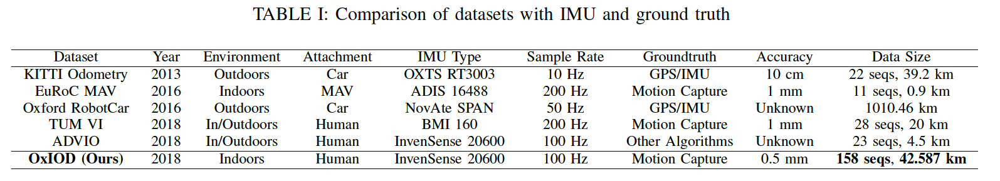

Scientific Machine Learning: Info Directory
===========================================

.. contents::

Data
---------
Oxford Inertial Odometry Dataset
~~~~~~~~~~~~~~~~~~~~~~~~~~~~~~~~

**Size:** 1.01 GB.  

**Location:** Available on MIT Supercloud system (requires you to be a member of the NDE group).  

**Link:** oxford_

Resources
--------------
Scientific ML IAP 
~~~~~~~~~~~~~~~~~
**Description:**  This course will be a project-based dive into scientific machine learning, directly going to the computational tools to learn how the practical aspects of "doing" scientific machine learning.  

**Link:** mit_sciml_ , theory_course_

Papers
------------------
* Chris Rackauckas, preprint, 2020, Universal_Differential_Equations_for_Scientific_Machine_Learning_

Still need help ? Email petermor@mit.edu

.. _oxford: http://deepio.cs.ox.ac.uk/
.. _mit_sciml: https://github.com/mitmath/18S096SciML
.. _theory_course: https://github.com/mitmath/18337
.. Universal_Differential_Equations_for_Scientific_Machine_Learning: https://arxiv.org/pdf/2001.04385.pdf
